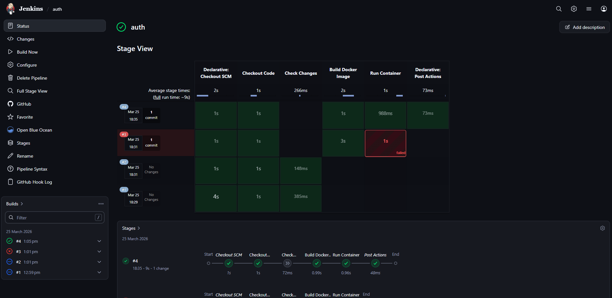

# 🚀 Branch-Aware Microservices CI/CD Pipeline

## 📌 Project Overview
A scalable and intelligent CI/CD pipeline designed for a microservices-based architecture where each service is independently built and deployed based on code changes.

## 🎯 Goal
To implement a clean and production-ready CI/CD system that:
* Detects changes at the service level
* Builds and deploys only the affected microservice
* Reduces unnecessary builds and improves efficiency

---

## ⚙️ Tech Stack
* **Jenkins** (CI/CD automation)
* **Docker** (Containerization)
* **GitHub** (Version Control)
* **GitHub Webhooks** (Trigger automation)
* **Node.js** (Sample microservices)
* **Linux / Ubuntu** (Execution environment)

---

## 🔥 Key Features
* ✅ **Service-level CI/CD pipelines** (auth, config, login)
* ✅ **Automatic trigger** via GitHub Webhooks
* ✅ **Path-based change detection** using `changeset`
* ✅ **Independent deployment** of microservices
* ✅ **Docker-based containerized deployment**
* ✅ **Parallel and scalable architecture**
* ✅ **Zero unnecessary builds** (only changed services run)

---

## 🏗️ Architecture

### 📦 Components:
* **GitHub Repository (Monorepo)**
* **Jenkins Server**
* **Docker Engine**
* **Microservices (Auth, Config, Login)**

### 🔄 Flow:
1. Developer pushes code to GitHub
2. GitHub Webhook triggers Jenkins
3. Jenkins pipelines (per service) are triggered
4. Each pipeline checks if its service changed
5. If changed → Build Docker image → Run container
6. If not → Skip execution

---

## 🔄 Workflow / How It Works
* Push code to a specific service folder (e.g., `auth-service/`)
* Jenkins pipeline for that service is triggered
* `changeset` condition checks if relevant files changed
* If match:
  * Docker image is built
  * Existing container is removed
  * New container is deployed
* If not:
  * Pipeline skips execution

---

## 🛠️ Setup Instructions

### 📌 Prerequisites
* Jenkins installed (with Git plugin)
* Docker installed on Jenkins agent
* GitHub account
* ngrok (for local webhook testing)

---

### 📥 Installation
```bash
git clone https://github.com/your-username/microservices-ci.git
cd microservices-ci
```

---

### ⚙️ Jenkins Configuration
1. Create 3 pipeline jobs:
   * `auth-pipeline`
   * `config-pipeline`
   * `login-pipeline`

2. Select: `Pipeline script from SCM`

3. Add:
   * Repo URL
   * Branch: `main`

4. Set Script Paths:
   * `auth-service/Jenkinsfile`
   * `config-service/Jenkinsfile`
   * `login-service/Jenkinsfile`

---

### 🔗 Webhook Setup
* Go to GitHub → Settings → Webhooks
* Add webhook: `http://<jenkins-url>/github-webhook/`
* Select: `Just the push event`

---

### ▶️ Run the Project
Push changes to any service:
```bash
echo "test" >> auth-service/test.txt
git add .
git commit -m "test auth"
git push
```

---

## 🔗 Integrations
* **GitHub Webhooks** (real-time CI trigger)
* **Docker** (container runtime)
* **Jenkins pipelines** (automation engine)

---

## 📦 CI/CD Pipeline

### 🔄 Pipeline Stages:
1. **Trigger**: GitHub push event
2. **Checkout**: Pull latest code from repository
3. **Change Detection**: Uses `changeset` to detect service-level changes
4. **Build**: Docker image creation
5. **Deploy**: Remove old container & run new container

---

## 🌿 Branch Strategy
* `main` → production-ready code
* `dev` (optional) → development/testing
* Feature branches → for new features

---

## 📸 Screenshots / Output

### Jenkins Dashboard


### GitHub Webhook Trigger


### Auth Service Pipeline Execution


### Config Service Pipeline & Testing


### Pipeline Console Output


---

## 🚀 Future Improvements
* DockerHub image push
* Version tagging (v1, v2, etc.)
* Kubernetes deployment
* Monitoring (Prometheus + Grafana)
* Blue-Green deployment strategy
* Centralized logging

---

## 📌 Learnings
* Real-world CI/CD design for microservices
* Handling Jenkins pipeline limitations
* Debugging Git + Jenkins integration issues
* Container lifecycle management
* Importance of service isolation in DevOps

---

## 🧠 Conclusion
This project demonstrates a production-style CI/CD pipeline for microservices using Jenkins and Docker. It highlights efficient automation, service-level deployment, and scalable architecture—key skills required for modern DevOps roles.
